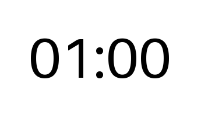
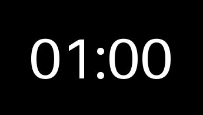

# Laikmačio GIF Generatorius | Countdown GIF Generator
[English below](#english)

## Lietuviškai | Lithuanian
Python kodas kurti, mūsų protmūšiuose naudojamus, animuotus laikmačio GIF su „Pillow“ biblioteka. [Pavyzdys](#pavyzdys--example)

### Reikalavimai

* Python 3 (naudota 3.13.2)
* [Pillow biblioteka](https://pypi.org/project/pillow/) (naudota 11.2.1)

### Naudojimas
1.  **Nustatymų keitimas (nebūtina):**
    Galima pakeisti konstantas, esančias `main.py` viršuje, `#=== Nustatymai ===#` skyriuje, kad sureguliuoti rezultatą

2.  **Paleisti programą:**
    ```bash
    python main.py
    ```
    arba (kadangi naudojau [uv](https://github.com/astral-sh/uv))
    ```bash
    uv sync && uv run main.py
    ```

3.  **Rezultatas:**
    Programa sukurs GIF failą tame pačiame aplanke pavadinimu, kurį nurodėte `NAME` konstantoje.

---

## English
Python code to create the animated countdown GIFs used in our "Mindfight" quiz with the Pillow library. [Example](#pavyzdys--example)

### Requirements

* Python 3 (used 3.13.2)
* [Pillow](https://pypi.org/project/pillow/) (used 11.2.1)

### Usage
1.  **Configure Settings (Optional):**
    [Configuration](#configuration)

2.  **Run the script:**
    ```bash
    python main.py
    ```
    or (since I used [uv](https://github.com/astral-sh/uv))
    ```bash
    uv sync && uv run main.py
    ```

3.  **Output:**
    The script will generate a GIF file named whatever you set `NAME` to in the same directory.

### Configuration
You can modify the following constants at the top of `main.py` within the `#=== Nustatymai ===#` section to customize the output:

* `NAME`: The desired filename for the output GIF (e.g., `"countdown.gif"`).
* `DURATION`: The total countdown time in seconds (e.g., `120` for 2 minutes).
* `DARKMODE`: Set to `True` for a dark background with light text, `False` for a light background with dark text.
* `BACKGROUND_COLOR`: RGB color for the background.
* `TEXT_COLOR`: RGB color for the text.
* `FADING`: Set to `True` to enable the text color fade effect near the end.
* `FADE_COLOR`: RGB color the text fades *to* during the final seconds.
* `FADE_START`: Number of seconds remaining when the fade effect begins.
* `FADE_END`: Number of seconds remaining when the fade effect is complete.
* `PADDING`: Pixels of empty space around the text.
* `FONT_SIZE`: The font size for the countdown text.
* `FONT`: The filename of a `.ttf` or `.otf` font file (e.g., `"arial.ttf"`). The font file must be in the same directory as the script. If set to `None` or the file isn't found, a default Pillow font will be used.

---

## Pavyzdžiai | Examples
Įprastas | Regular



Tamsus | Darkmode


